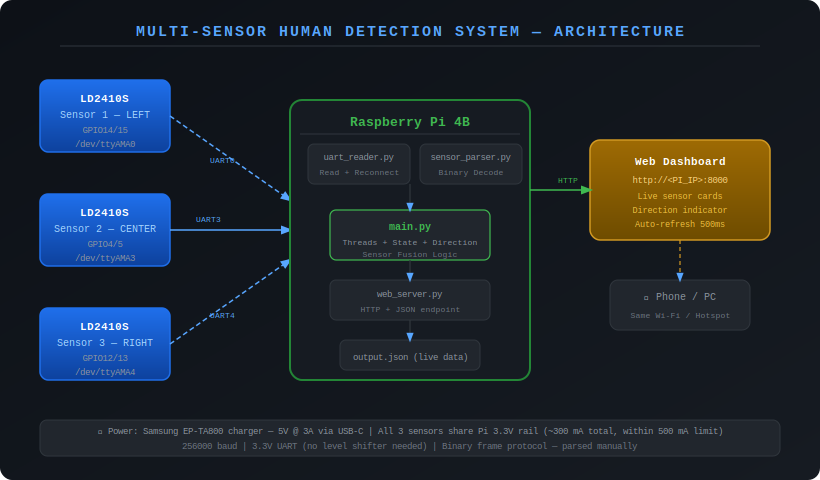
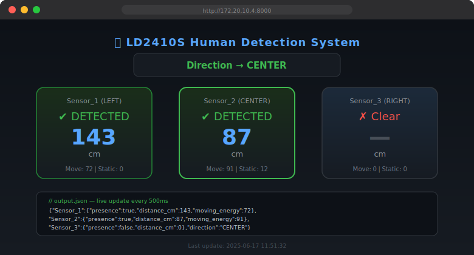

# Multi-Sensor Human Detection System
### LD2410S mmWave Radar × Raspberry Pi 4B

---

## Overview

A real-time embedded system using three LD2410S mmWave radar sensors connected to a Raspberry Pi 4B. The system detects human presence, estimates distance, and determines direction using multi-sensor fusion, with live visualization via a web dashboard.

> Designed as a real-world embedded system integrating hardware sensing, low-level communication, and networked visualization on a single-board computer.

---

## Quick Run

```bash
git clone <repo>
cd ld2410-human-detection
bash setup.sh
python3 src/main.py
```

Open: `http://<PI_IP>:8000`

---

## Why This Project?

This project demonstrates:

- Real-world embedded system design
- Multi-UART hardware interfacing on Raspberry Pi
- Low-level binary protocol handling (no third-party sensor libraries)
- System-level debugging (power supply, UART config, wiring)
- Integration of hardware, software, and networking

---

## Key Highlights

- Real-time multi-UART sensor acquisition (3 sensors simultaneously)
- Custom binary protocol parser — no external libraries
- Sensor fusion for LEFT / CENTER / RIGHT direction estimation
- Fault-tolerant UART handling with automatic reconnect
- Live monitoring via web dashboard (accessible from any device on the same network)

---

## System Architecture



---

## Web Dashboard



Live dashboard served at `http://<PI_IP>:8000` — auto-refreshes every 500 ms. Shows presence, distance, and direction for all three sensors.

---

## Hardware

| Component | Details |
|---|---|
| Raspberry Pi 4B | Any RAM variant |
| LD2410S radar sensor | ×3, 3.3V UART, 256000 baud |
| Power supply | 5V 3A USB-C (Samsung EP-TA800 confirmed) |
| Jumper wires | Female-female, ~15 pcs |

### Wiring Summary

| Sensor | UART Device | GPIO TX | GPIO RX |
|---|---|---|---|
| Sensor 1 (LEFT) | `/dev/ttyAMA0` | GPIO14 (Pin 8) | GPIO15 (Pin 10) |
| Sensor 2 (CENTER) | `/dev/ttyAMA3` | GPIO4 (Pin 7) | GPIO5 (Pin 29) |
| Sensor 3 (RIGHT) | `/dev/ttyAMA4` | GPIO12 (Pin 32) | GPIO13 (Pin 35) |

**Always cross TX/RX:** Sensor OT1 (TX) → Pi RX pin, Sensor RX ← Pi TX pin.

See [`docs/hardware_setup.md`](docs/hardware_setup.md) for full wiring table.

---

## Software Setup

### 1. Clone the repository

```bash
git clone https://github.com/<your-username>/ld2410-human-detection.git
cd ld2410-human-detection
```

### 2. Configure UART in `/boot/config.txt`

```bash
sudo nano /boot/config.txt
```

Add at the bottom:

```ini
enable_uart=1
dtoverlay=disable-bt
dtoverlay=uart3,txd3_pin=4,rxd3_pin=5
dtoverlay=uart4,txd4_pin=12,rxd4_pin=13
```

Save and reboot:
```bash
sudo reboot
```

### 3. Disable serial console

```bash
sudo raspi-config
# Interface Options → Serial Port
# Login shell: No  |  Hardware enabled: Yes
```

### 4. Install dependencies

```bash
bash setup.sh
# OR manually:
sudo apt install python3-serial
sudo usermod -aG dialout $USER
```

Log out and back in (or reboot) for the group change to apply.

### 5. Verify UART ports

```bash
ls /dev/ttyAMA*
# Expected: /dev/ttyAMA0  /dev/ttyAMA3  /dev/ttyAMA4
```

Run the hardware test:
```bash
python3 test_uart.py
```

### 6. Run the system

```bash
python3 src/main.py
```

Open in browser: `http://<PI_IP>:8000`  
Find your IP: `hostname -I`

---

## Project Structure

```
ld2410-human-detection/
│
├── src/
│   ├── main.py           # Entry point, threads, direction logic
│   ├── uart_reader.py    # Serial port open/read/reconnect
│   ├── sensor_parser.py  # LD2410S binary frame decoder
│   └── web_server.py     # HTTP server (dashboard + JSON endpoint)
│
├── docs/
│   ├── architecture.svg         # System architecture diagram
│   ├── dashboard_screenshot.svg # Web dashboard preview
│   ├── hardware_setup.md        # Wiring diagrams, component list
│   ├── uart_config.md           # /boot/config.txt guide
│   └── troubleshooting.md       # Common issues and fixes
│
├── test_uart.py     # Hardware verification script (run first)
├── setup.sh         # One-time setup script
├── requirements.txt # Python dependencies
└── README.md
```

---

## Troubleshooting

| Problem | Quick Fix |
|---|---|
| `/dev/ttyAMA*` missing | Check `/boot/config.txt` syntax; no spaces around `=` |
| `Permission denied` | `sudo usermod -aG dialout $USER` then reboot |
| No data from sensor | Verify TX/RX are crossed in wiring |
| Wrong baud rate | Try 115200 in `main.py` if 256000 gives no data |
| Web page not loading | Check `hostname -I` and open `http://<IP>:8000` |
| Undervoltage warning ⚡ | Use 5V 3A supply with good USB-C cable |

See [`docs/troubleshooting.md`](docs/troubleshooting.md) for detailed solutions.

---

## Future Improvements

- **GPS tagging** — attach coordinates to detection events (u-blox NEO-6M)
- **Camera integration** — visual confirmation with OpenCV + Pi Camera
- **MQTT / IoT dashboard** — publish to Node-RED or Grafana
- **AI presence classification** — TensorFlow Lite on-device inference
- **Systemd service** — auto-start on boot
- **Alert system** — SMS/email on detection via Twilio or SMTP

---

## Developed By

**Gagan Manjunath**  
NIE - South, Mysuru
Electronics and Communication Engineering (ECE)  
Project: CSR Body Detection Sensor Network  

**Srujan H R**
Yuvaraja's College, Mysuru
BSc (Maths, Statistics, Computer Science)
